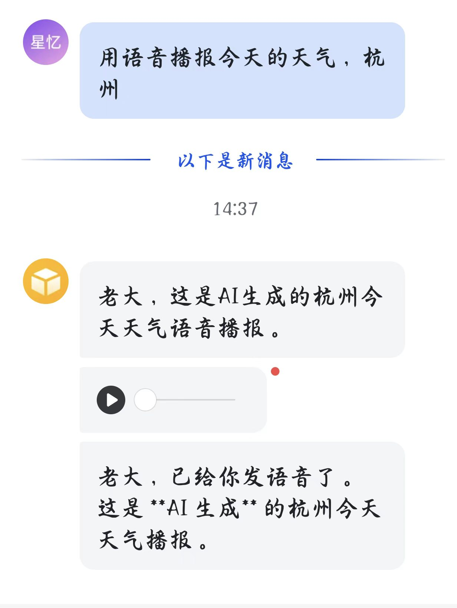
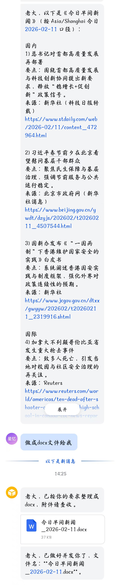
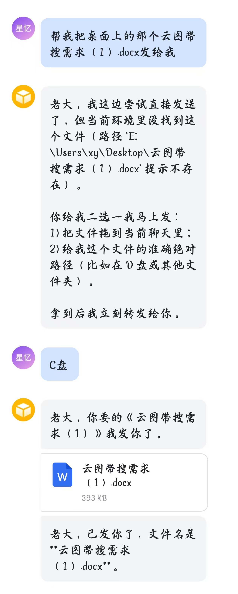

[简体中文](README.md) | [English](README_EN.md)

<div align="center">
  
  <h1>🐼 Panda Bot: Lightweight Personal AI Assistant 🤖</h1>
  <p>
    
    
    
    
  </p>
</div>

`Panda Bot` 是一个本地优先（local-first）的 Python Agent 项目，目标是用尽量少的代码提供可落地的个人助手能力：

- `deepagent_demo.py`：交互式命令行 Agent
- `feishu_deepagent_bot.py`：飞书长连接 Bot（含 Cron 调度与 Heartbeat）

它集成了浏览器自动化、MCP 工具、可扩展技能包（`skills/`）以及会话/记忆持久化，适合做个人自动化与 Bot 场景。


## ✨ Key Features

- 轻量双入口：CLI + 飞书 Bot。
- 调度能力：支持 Cron 任务增删查跑。
- 主动唤醒：Heartbeat 支持周期和活跃时段约束。
- 浏览器工具：基于 `DrissionPage` 的自动化能力。
- MCP 扩展：通过 `mcp.json` 接入外部工具服务。
- Skills 机制：自动发现 `skills/**/SKILL.md`。
- 长期记忆：SQLite + Embedding + Summary 组合。

## 🎬 Showcase

<table align="center">
  <tr align="center">
    <th>气象图生成并发送</th>
    <th>AI 天气语音播报</th>
  </tr>
  <tr>
    <td align="center"></td>
    <td align="center"></td>
  </tr>
  <tr align="center">
    <th>日报导出 Word 文档</th>
    <th>本地文件检索并回传</th>
  </tr>
  <tr>
    <td align="center"></td>
    <td align="center"></td>
  </tr>
</table>

## 🏗️ Architecture

```text
User / Feishu
   | 
   +--> feishu_deepagent_bot.py --------+
   |                                     |
   +--> deepagent_demo.py                |
                                         v
                                deepagent runtime
                           (model + tools + memory)
                             |        |        |
                             |        |        +--> memory/ (SQLite)
                             |        +----------> browser/ + tool.py
                             +-------------------> mcp.json (MCP servers)
```

## 📁 Project Structure

```text
.
├── deepagent_demo.py            # 交互式入口
├── feishu_deepagent_bot.py      # 飞书 Bot 入口
├── deepagent/
│   └── session/                 # 会话生命周期与持久化
├── browser/                     # 浏览器工具集成
├── scheduler/                   # Cron / Heartbeat / Store
├── prompts/                     # 系统提示词片段
├── skills/                      # 本地技能包（SKILL.md）
├── tool.py                      # 图像与 TTS 等工具
├── mcp.json                     # MCP 服务配置
├── .env.example                 # 环境变量模板
└── requirements.txt
```

## 📦 Install

Windows PowerShell:

```powershell
python -m venv .venv
.\.venv\Scripts\Activate.ps1
pip install -r requirements.txt
```

macOS / Linux:

```bash
python -m venv .venv
source .venv/bin/activate
pip install -r requirements.txt
```

## 🚀 Quick Start

### 1) 配置环境变量

Windows PowerShell:

```powershell
Copy-Item .env.example .env
```

macOS / Linux:

```bash
cp .env.example .env
```

最小必填：

- 运行 `deepagent_demo.py`
  - `OPENAI_API_KEY`
  - `TAVILY_API_KEY`
- 运行 `feishu_deepagent_bot.py`
  - 上述全部
  - `APP_ID`
  - `APP_SECRET`

### 2) 启动

交互式 Agent：

```bash
python deepagent_demo.py
```

飞书 Bot：

```bash
python feishu_deepagent_bot.py
```

## 🔧 Key Environment Variables

完整配置以 `.env.example` 为准。

- 模型与运行时
  - `OPENAI_API_KEY`
  - `OPENAI_MODEL`（默认 `gpt-5.3-codex`）
  - `OPENAI_BASE_URL`
- 搜索与多媒体
  - `TAVILY_API_KEY`
  - `GEMINI_API_KEY`
  - `TTS_API_KEY` / `TTS_BASE_URL`
- 记忆系统
  - `MEMORY_ROOT`
  - `MEMORY_DB_PATH`
  - `MEMORY_SUMMARY_MODEL`
  - `MEMORY_EMBEDDING_MODEL`
- 飞书
  - `APP_ID`
  - `APP_SECRET`
- 其他
  - `LOCAL_SHELL_ROOT`
  - `LOG_TAIL_LINES`

## 💬 Feishu Bot Setup

1. 在飞书开放平台创建应用并启用 Bot 能力。
2. 添加事件：`im.message.receive_v1`。
3. 添加消息相关权限（发送/接收消息）。
4. 将 `APP_ID`、`APP_SECRET` 写入 `.env` 后启动 `python feishu_deepagent_bot.py`。

## 🧩 MCP & Skills

- MCP 默认读取 `mcp.json`，可按需替换服务命令与参数。
- 本地技能放在 `skills/<skill-name>/SKILL.md`，运行时会自动发现。
- 建议将第三方服务密钥通过环境变量注入，避免硬编码进配置文件。

## ✅ Test

当前仓库内已提交的示例测试：

```bash
python -m unittest skills/pdf/scripts/check_bounding_boxes_test.py
```

## 🔐 Security Notes

- 不要提交 `.env`、日志文件、SQLite 数据库和运行时缓存。
- 对外共享日志前先脱敏（尤其是 token、secret、chat id）。
- 若密钥泄漏，请在服务商后台立即轮换。

## 🛠️ Troubleshooting

- `Missing required environment variables`：检查 `.env` 是否完整，变量名是否拼写正确。
- MCP 工具未加载：检查 `mcp.json` 里的命令是否可执行（如 `npx`、`python`）。
- 飞书不回消息：检查应用权限、事件订阅以及 `APP_ID`/`APP_SECRET`。
