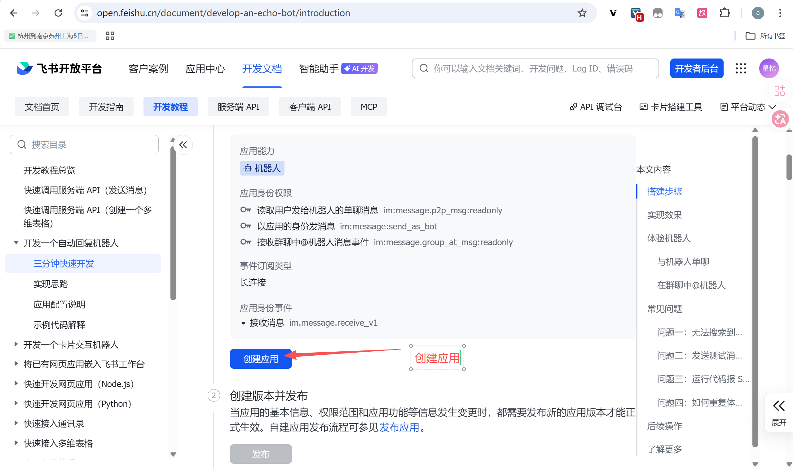
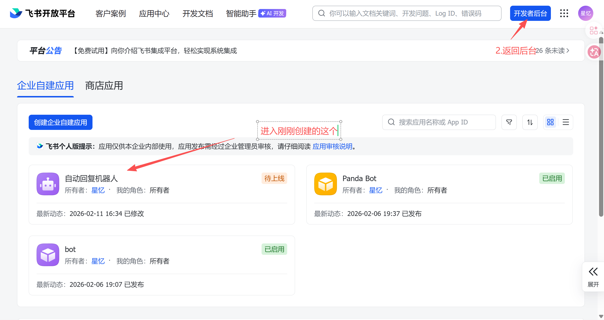
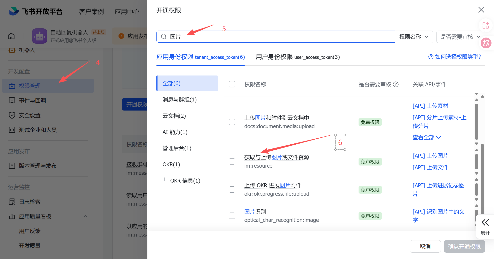
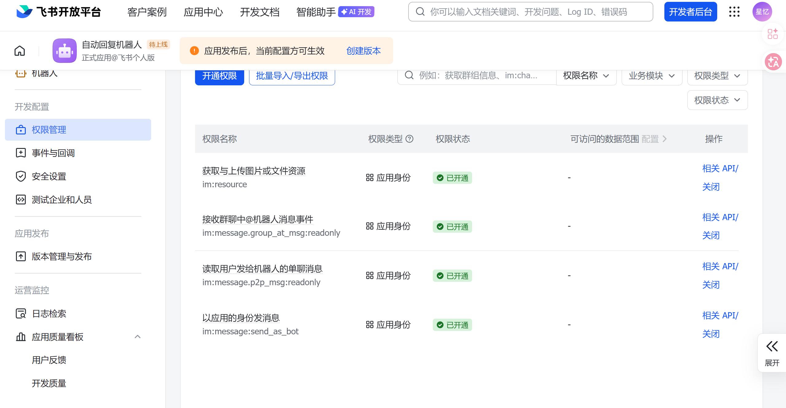
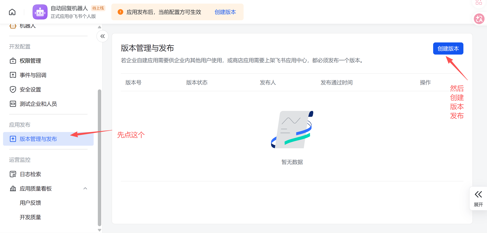
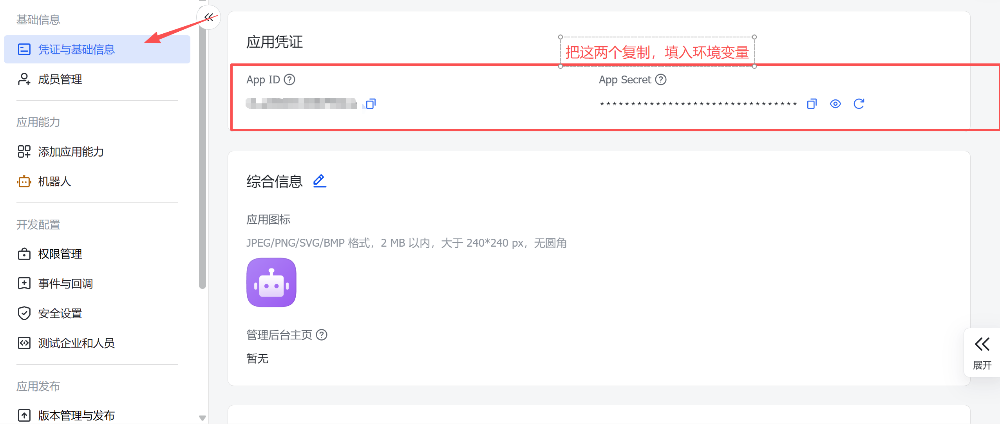

# Panda Bot 部署文档

更新时间：2026-02-11

## 1. 文档目标

本文用于指导你把当前仓库部署为可运行的Panda Bot服务，覆盖：

- 环境配置
- 依赖安装与数据库配置
- 飞书机器人部署（参考官方文档）
- 本地运行与生产部署建议
- 常见问题排查

## 2. 部署入口说明

本项目包含两个入口脚本：

- `deepagent_demo.py`：本地交互式 Agent（命令行）
- `feishu_deepagent_bot.py`：飞书长连接机器人（内置 Cron + Heartbeat）

## 3. 运行环境准备

### 3.1 基础要求

- Python 3.12+

- 可用的 OpenAI 兼容模型网关

- 可选：Node.js（用于 MCP 的 `npx` 工具）

### 3.2 安装依赖

Windows PowerShell：

```powershell
python -m venv .venv
.\.venv\Scripts\Activate.ps1
pip install -r requirements.txt
```

## 4. 环境变量配置

先复制模板：

```bash
cp .env.example .env
```

`.env.example` 全部变量如下：

| 变量                        | 是否必填      | 说明                          | 建议                                                                |
| ------------------------- | --------- | --------------------------- | ----------------------------------------------------------------- |
| `APP_ID`                  | 飞书模式必填    | 飞书应用 ID                     | 飞书开放平台应用凭证                                                         |
| `APP_SECRET`              | 飞书模式必填    | 飞书应用 Secret                 | 飞书开放平台应用凭证                                                         |
| `OPENAI_API_KEY`          | 是         | 主模型 API 密钥                  | 可使用 API 中转，或官方 OpenAI 兼容接口                                          |
| `OPENAI_MODEL`            | 建议        | 主模型名称                       | 如 `gpt-5.3-codex`、Claude、GLM 等                                     |
| `OPENAI_BASE_URL`         | 建议        | OpenAI 兼容网关地址               | 默认 `https://api.openai.com/v1`，也可替换为中转/自建网关                        |
| `TAVILY_API_KEY`          | 是         | 联网搜索 API 密钥                 | 申请地址：https://www.tavily.com/                                      |
| `MEMORY_ROOT`             | 可选        | 记忆目录根路径                     | 默认 `memory`                                                        |
| `MEMORY_MAX_MESSAGES`     | 可选        | 会话中保留的消息数量                  | 默认 `20`                                                            |
| `MEMORY_SUMMARY_MODEL`    | 可选        | 记忆摘要模型                      | 默认 `claude-haiku-4-5-20251001`                                    |
| `MEMORY_EMBEDDING_MODEL`  | 可选        | 向量化模型                        | 默认 `text-embedding-3-small`                                       |
| `MEMORY_TOP_K`            | 可选        | 记忆检索返回条数                     | 默认 `5`                                                             |
| `MEMORY_MIN_SCORE`        | 可选        | 记忆检索最低相似度阈值                 | 默认 `0.2`                                                           |
| `MEMORY_DB_PATH`          | 可选        | 记忆 SQLite 路径                | 默认 `memory/memory.sqlite`                                         |
| `MEMORY_SUMMARY_KEY`      | 可选        | 摘要模型 API Key                | 不填时回退使用 `OPENAI_API_KEY`                                            |
| `GEMINI_API_KEY`          | 可选        | Gemini 工具 API Key           | 用于图像相关工具                                                           |
| `LOCAL_SHELL_ROOT`        | 可选        | 本地命令执行默认根目录                 | Linux 默认示例 `/opt/deepagent`                                        |
| `MEMORY_SUMMARY_BASE_URL` | 可选        | 摘要模型 Base URL               | 默认 `https://api.openai.com/v1`                                    |
| `MEMORY_EMBEDDING_API_KEY` | 可选        | 向量模型 API Key                | 可与主模型 Key 分离                                                        |
| `MEMORY_EMBEDDING_BASE_URL` | 可选       | 向量模型 Base URL               | 默认 `https://api.openai.com/v1`                                    |
| `TTS_API_KEY`             | 可选        | 语音合成 API Key                | 用于 TTS 功能                                                          |
| `TTS_BASE_URL`            | 可选        | 语音合成 Base URL               | 默认 `https://api.openai.com/v1`                                    |
| `LOG_TAIL_LINES`          | 可选        | 日志尾部读取行数                    | 默认 `50`                                                            |

安全要求：

- 不要提交 `.env`
- 对外只保留 `.env.example`
- 生产环境建议使用密钥管理系统

## 5. 飞书机器人部署（长连接模式）

本项目使用飞书服务端 SDK 长连接（WebSocket）模式。

部署流程图（按顺序）：








### 5.1 创建应用

1. 打开飞书开发者后台：`https://open.feishu.cn/app`

2. 创建企业自建应用

3. 开启机器人能力（Bot）

4. 获取 `APP_ID` 和 `APP_SECRET` 并写入 `.env`

### 5.2 配置权限与事件

在飞书应用后台完成：

1. 在权限管理中添加消息相关权限（按后台搜索 `im`、`message`）
2. 在事件订阅中开启消息接收事件（本项目监听 `p2_im_message_receive_v1`）
3. 发布应用版本，使权限和订阅生效

说明：

- 当前项目是长连接模式，通常不要求公网回调 URL
- 若改为 HTTP 回调模式，需要按官方事件订阅文档额外配置公网地址

### 5.3 安装与可见性验证

1. 将应用安装到目标租户
2. 把机器人加入测试会话（私聊或群聊）
3. 确认机器人具备收发消息权限

## 6. 启动与验收

### 6.1 启动命令

交互式：

```bash
python deepagent_demo.py
```

飞书机器人：

```bash
python feishu_deepagent_bot.py
```

### 6.2 验收清单

- 启动无 `Missing environment variable` 报错
- 飞书中可收到机器人回复
- Cron 工具可新增/列出/执行任务
- Heartbeat 在配置时间窗口内触发

## 7. 生产部署建议

### 7.1 推荐目录

- 代码目录：`/opt/deepagent`
- 日志目录：`/opt/deepagent/logs`
- 运行时目录：`/opt/deepagent/runtime`

### 7.2 systemd 示例（Linux）

```ini
[Unit]
Description=DeepAgent Feishu Bot
After=network.target

[Service]
Type=simple
WorkingDirectory=/opt/deepagent
EnvironmentFile=/opt/deepagent/.env
ExecStart=/opt/deepagent/.venv/bin/python feishu_deepagent_bot.py
Restart=always
RestartSec=5

[Install]
WantedBy=multi-user.target
```

## 8. 常见问题排查

# 

### 8.2 飞书收不到消息

- 检查应用是否已安装到目标租户
- 检查权限是否已发布生效
- 检查事件订阅是否正确开启

### 8.3 机器人不回复

- 检查 `OPENAI_API_KEY` / `OPENAI_BASE_URL` / `OPENAI_MODEL`
- 检查服务器网络与防火墙策略

## 9. 飞书官方文档参考

- 开发者后台：`https://open.feishu.cn/app`
- 开放平台文档首页：`https://open.feishu.cn/document/`
- 服务端 API 调用指南：`https://open.feishu.cn/document/server-docs/api-call-guide/calling-process`
- 发送消息 API：`https://open.feishu.cn/document/server-docs/im-v1/message/create`
- 消息接收事件：`https://open.feishu.cn/document/server-docs/im-v1/message/events/receive`
- Python SDK 文档入口：`https://open.feishu.cn/document/uAjLw4CM/ukTMukTMukTM/server-side-sdk/python-sdk`

---

建议把本文作为部署基线文档，后续可在此基础上补充你的服务器架构、监控、备份和告警策略。

## 10. 环境变量全量清单（代码扫描）

以下清单基于当前仓库代码与配置文件汇总（去重）：

```text
APP_ID
APP_SECRET
BASE_DOMAIN
BROWSER_HEADLESS
BROWSER_NO_SANDBOX
BROWSER_PROXY
DEEPAGENT_AGENT_ID
DEEPAGENT_RUNTIME_ROOT
DEEPAGENT_THREAD_ID
EMBEDDING_BASE_URL
EXEC_OUTPUT_ENCODING
FEISHU_BOT_LOG
FEISHU_DISABLE_MCP
FEISHU_INBOUND_DIR
FEISHU_MEMORY_DB_PATH
FEISHU_MEMORY_ROOT
FIRECRAWL_API_KEY
GEMINI_API_KEY
HEARTBEAT_ACTIVE_END
HEARTBEAT_ACTIVE_START
HEARTBEAT_ACTIVE_TZ
HEARTBEAT_EVERY
HEARTBEAT_PROMPT
HISTORY_ROOT
http_proxy
HTTP_PROXY
https_proxy
HTTPS_PROXY
LOCAL_SHELL_ROOT
LOCALAPPDATA
LOG_SUMMARY_WORDS
LOG_TAIL_CHARS
LOG_TAIL_LINES
LOG_TOOL_CALLS
MCP_CONFIG
MCP_SERVERS
MEDIA_OUTPUT_DIR
MEMORY_DB_PATH
MEMORY_EMBEDDING_API_KEY
MEMORY_EMBEDDING_BASE_URL
MEMORY_EMBEDDING_KEY
MEMORY_EMBEDDING_MODEL
MEMORY_MAX_MESSAGES
MEMORY_MIN_SCORE
MEMORY_ROOT
MEMORY_SUMMARY_API_KEY
MEMORY_SUMMARY_BASE_URL
MEMORY_SUMMARY_EVERY
MEMORY_SUMMARY_KEY
MEMORY_SUMMARY_MODEL
MEMORY_TOP_K
OPENAI_API_KEY
OPENAI_BASE_URL
OPENAI_MODEL
PROMPTS_DIR
SANDBOX_TIMEOUT
SCHEDULER_DB_PATH
SKILLS_DIR
TAVILY_API_KEY
TTS_API_KEY
TTS_BASE_URL
TTS_KEY
TTS_MODEL
TTS_URL
TTS_VOICE
```

补充：`mcp.json` 中还有 `YOUR_AMAP_API_KEY` 占位符，它不是环境变量名。
